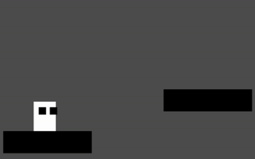
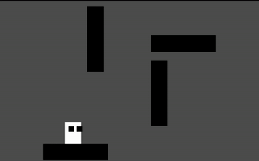
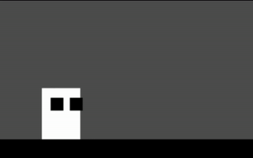
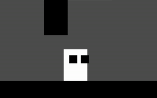
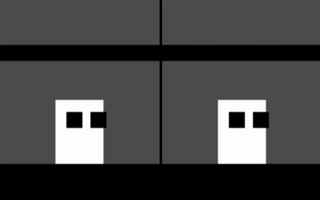

# 2D Platformer Controller
A feature-rich 2D platformer controller made in [Godot Engine](https://godotengine.org/).

### Features
- **Basic movement with Acceleration and Deceleration**

- **Jump with Variable Jump Height** 
  

- **Coyote Time and Jump Buffering for both Floor and Wall Jumps** 
  

- **Speed Boost and Gravity Adjustment at Jump Peak**

- **Wall Slide and Wall jump** 
  

- **Dash** 
  

- **Corner Correction** 
  

- **One-Way Platform Assist** 
  

## Requirements
- **[Godot Engine v4.5.1-stable](https://github.com/godotengine/godot/releases/tag/4.5.1-stable)**

## License
- **This project is under the MIT License. See [LICENSE](LICENSE) for details.**